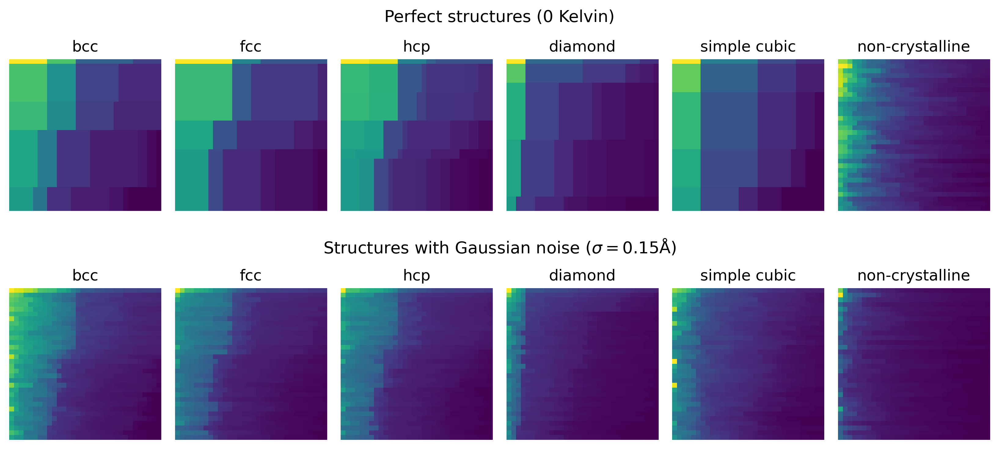
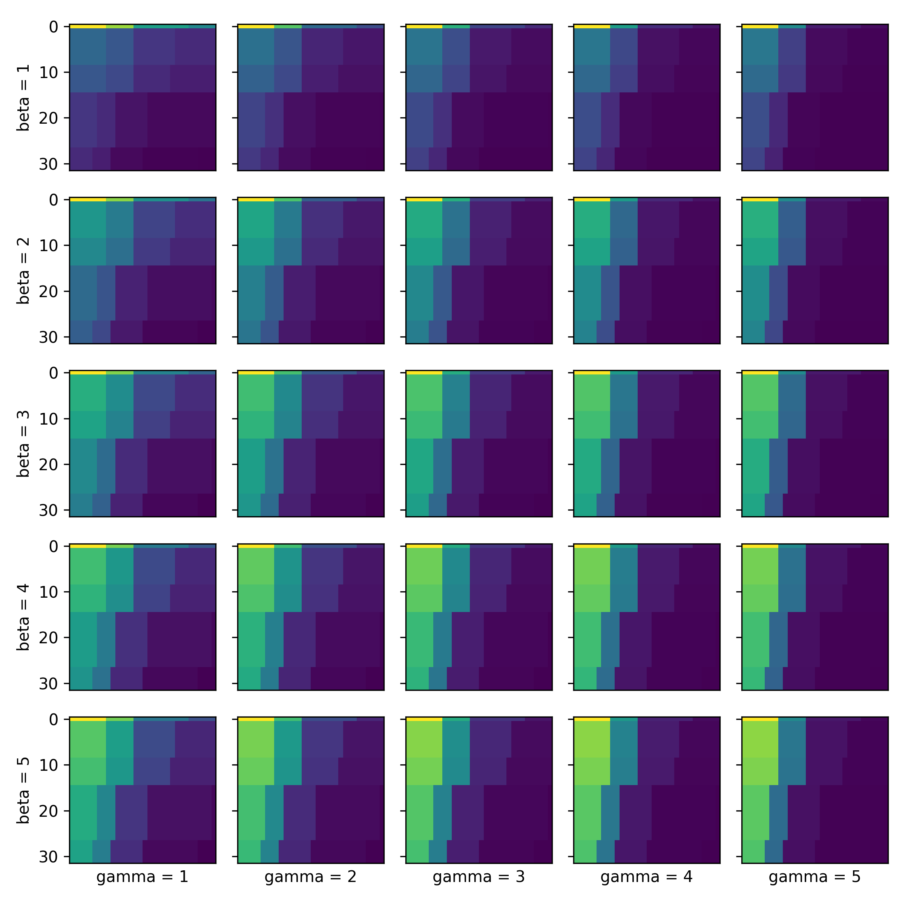

# Neighbors maps

Companion repository for Allera et al. (2023) https://arxiv.org/abs/2307.00978.


# Basic usage

```py
import ase.lattice
import matplotlib.pyplot as plt

from neighbor_maps import Atoms

p = Atoms(ase.lattice.cubic.BodyCenteredCubic("Fe", size=(4,4,4)))
plt.imshow(p.get_neighbor_map(atom_id=0, r_cut=6.0, img_target_size=32))
plt.axis("off")
```


# Examples

## Neighbors maps of typical crystalline and non-crystalline structures

As shown in Fig.2 of the original publication. Figure generated by the script 



## Neighbors maps of a series of different Bravais lattices. 

Figure generated by the script 


## Neighbors maps of systems containing point defects

Figure generated by the script 


## Note on hyperparameter selection

In the original publication, we introduce the parameters beta and gamma, which are to be used to tune the decay rate of the pixel intensity, row-wise, and column-wise. 
This is in some way analogous to tuning the brightness and contrast of images, a standard pre-processing step in image analysis methods, but here based on interatomic distances rather than raw pixel values. 
Much like contrast adjustment in image processing, choosing different values of beta and gamma can increase the sharpness of some visual features that appear on the Neighbors Maps, possibly resulting in easier training of the CNN.

The figure below shows the effect of variying the values of these parameters. 
The code to generate this figure is available in . 

